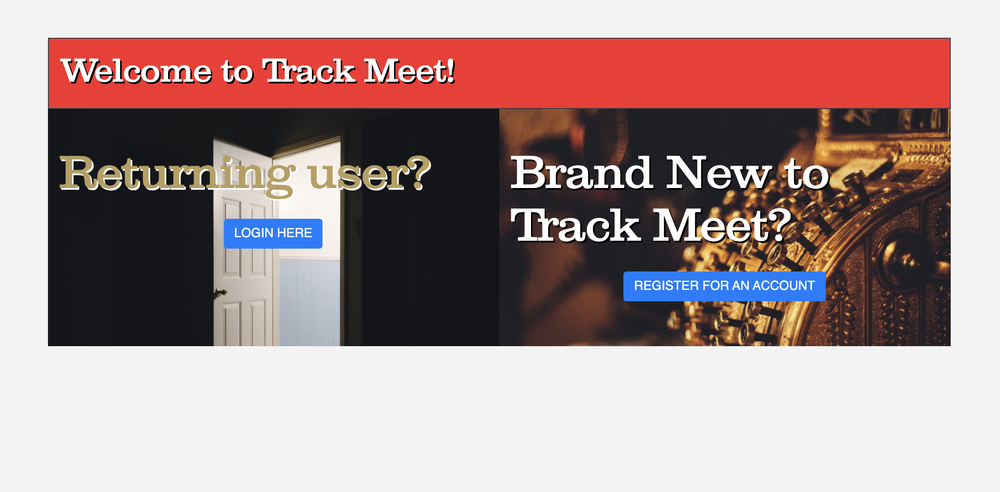

### ⚠⚠⚠ A work-in-progress ⚠⚠⚠
# Track Meet MERN: The "big refactor" 

In 2020, I completed my capstone project for General Assembly's Software Engineering Immersive: ["Track Meet"](https://github.com/danlehner/trackmeet), a personalized music journal to promote conscious music listening. I was proud of my work and what I accomplished on my own and in a relatively short period of time. 

The thing is, though, that the app is..._fine_. Not terrible, but not great. The biggest problem with it is that it _looks_ like a bootcamp grad's project, not the work of a professional. 

I know I can do better. So that's exactly what I'm doing.

## Goals 
There are several areas that I intend to improve on with the new app: 
 
* Create and deploy the API and client sides of the app separately (likely on Heroku and Netlify, respectively) for faster performance, better security and improved separation of concerns / code maintenance (the code for the API is available for preview on its [README](https://github.com/danlehner/trackmeet-mern-api))
* Implementing React as a part of the core functionality and data management of the app to eliminate the need for jQuery (or even vanilla JS)-based DOM manipulation, reduce the clutter/amount of code, improve UX and scoping the programmatic functions of the app to where they are relevant 
* Using Recoil for login/logout functionality to keep up with current trends in React global state management 
* Giving users the option to try the app without signing up (via generated login credentials and prepopulated data)
* Improving general styling and organization for aesthetic purposes (make it look 
* Getting rid of Bootstrap in favor of from-the-ground-up CSS to eliminate the use of “!important” overwriting of styles and improving performance
* Using Sass for greater styling options and modular organization 

## Stretch Goals: 

* Integrate with Twilio to be able send SMS lists of "yet-to-listen-to songs" to further enhance the core purpose of the app 
* Experiment with GraphQL as an alternative to a REST API to reduce overfetching

# VS. 

